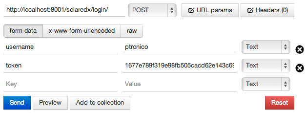

.. _login:

Login
=====

Idealmente o sistema de autenticação deverá ser implementado utilizando o 
protocolo `OAuth2 <http://oauth.net/2/>`_. Quando isso ocorrer o sistema de 
login fará parte da API do pacote SolarEDX. Enquanto isso, será utilizado 
um sistema de autenticação simplificado, descrito abaixo:

Sistema de login simplificado
-----------------------------

O sistema de login simplificado consiste em uma requisição POST com destino
à URL ``/login/`` do SolarEDX. O próprio usuário deverá efetuar essa 
requisição, pois o SolarEDX irá autenticar a **sua sessão de acesso**.

.. note::

    Um formulário html com campos ocultos é capaz de tornar essa requisição 
    tão simples quanto o clique em um link. 

O ``token`` de autenticação deverá ser gerado utilizando `HMAC 
<http://en.wikipedia.org/wiki/Hash-based_message_authentication_code>`_ 
e função de hash SHA1. O valor a ser criptografado deve ser o ``username`` 
do usuário. A ``key`` (chave) deverá ser fornecida pelo Solar, no ato da
instalação do SolarEDX (veja a variável ``SOLAREDX_SECRET_KEY`` em 
:ref:`conf`). Por fim, o resultado da criptografia deverá ser 
codificado em hexadecimal.

**Veja abaixo um exemplo de login, realizado com a extensão 
Postman Google Chrome:**

